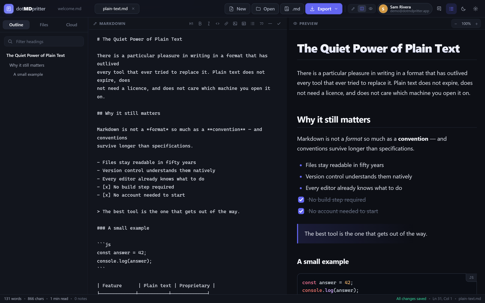
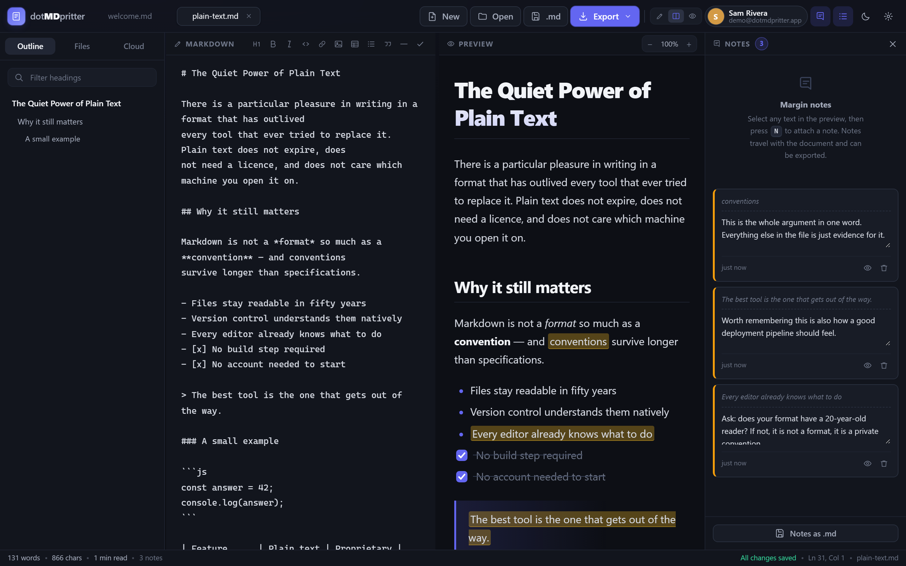
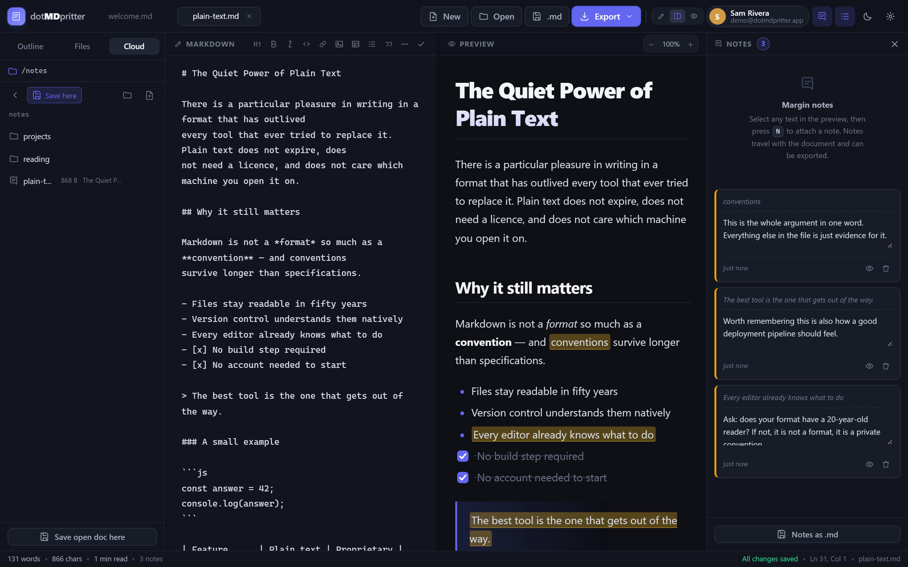
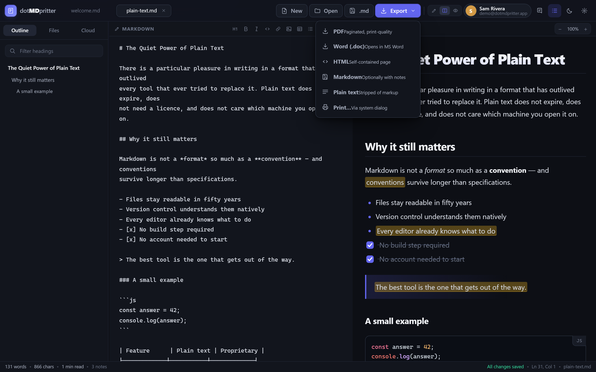
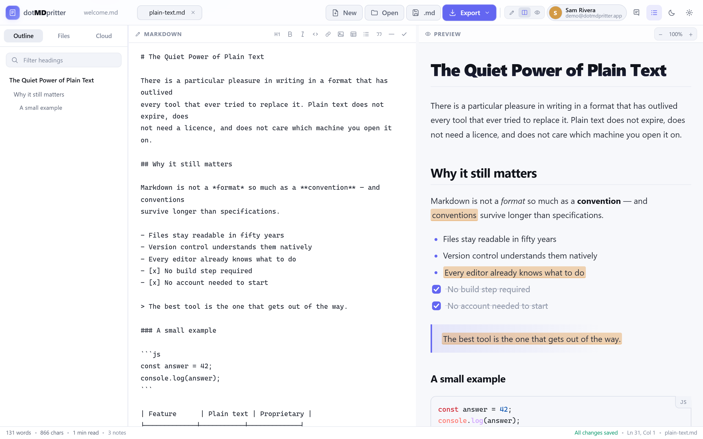
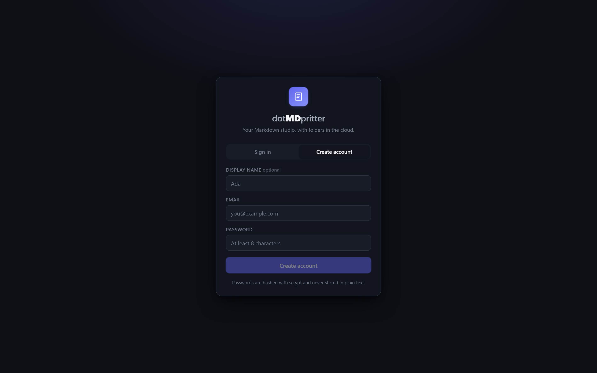
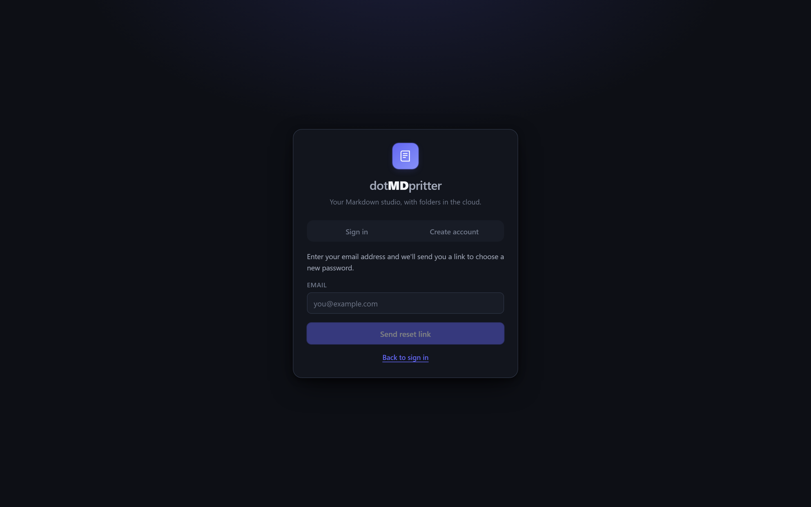
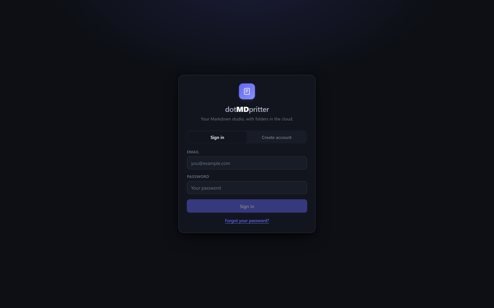

<h1 align="center">dotMDpritter</h1>

<p align="center">
  <b>A beautiful, offline-first Markdown editor with accounts, folders in the cloud, and margin notes.</b>
</p>

<p align="center">
  
</p>

<p align="center">
  <a href="#screenshots">Screenshots</a> ·
  <a href="#quick-start">Quick start</a> ·
  <a href="#what-it-does">Features</a> ·
  <a href="#tools-used">Tools</a> ·
  <a href="#security">Security</a> ·
  <a href="#project-layout">Layout</a> ·
  <a href="#deploying">Deploying</a>
</p>

<p align="center">
  
  
  
  
  
</p>

---

Drop a `.md` file in, get clean typography, annotate it in the margins, save it
to your own folder tree, and export to **PDF**, **Word**, HTML, Markdown or
plain text.

**No build step. No framework. No npm dependencies.** Every third-party library
is vendored locally and the backend uses only Node's standard library — so the
whole thing is one folder you can copy, `node server.js`, and use.

| | |
|---|---|
| **Runtime** | Node.js ≥ 16. No `npm install` required. |
| **Dependencies** | Zero. The five libraries in `vendor/` are vendored. |
| **Tests** | 324 assertions, all passing. |
| **Data** | Plain `.md` files in a folder you own and can back up. |

---

## Screenshots

### Split view with live preview

Syntax-highlighted source on the left, rendered document on the right. Tick a
task-list box in the preview and it rewrites `- [ ]` to `- [x]` in the Markdown
source, so it saves like any other edit.


### Margin notes

Select text in the preview, press <kbd>N</kbd>, and the note attaches to that
exact phrase. Notes travel inside the document and are included in the Markdown
and PDF exports.



### Cloud folders

Every account gets its own folder tree on the server. Browse, open, save,
rename, delete. Files stay ordinary `.md` files you can reach from a terminal.



### Exports

PDF, Word, self-contained HTML, Markdown (optionally with notes), plain text,
and your system print dialog.



### Light theme

The same design in light mode, because it is a token-driven theme rather than a
second stylesheet.



### Accounts, and getting back in

<p align="center">
  
  
  
</p>


---

## Quick start

```bash
git clone <your-fork-url> dotMDpritter
cd dotMDpritter
node server.js          # → http://localhost:4173
```

That's it — no `npm install`, because there are no dependencies to install.

Open the URL, click **Create account**, and you are in. Drop a `.md` file on the
app with **Open**, or press <kbd>Ctrl</kbd>+<kbd>N</kbd> for a blank document.
Use the **Cloud** tab in the sidebar to browse folders, open files, and save
your work.

<details>
<summary>Configuration</summary>

Everything is optional. Copy `.env.example` to `.env` and set what you need.

| Variable | Default | What it does |
| --- | --- | --- |
| `PORT` | `4173` | HTTP port |
| `DOTMD_DATA` | `./data` | Where files and accounts live |
| `DOTMD_SECURE` | — | Set to `1` behind HTTPS so the cookie gets `Secure` |
| `DOTMD_SMTP_HOST` / `_PORT` / `_USER` / `_PASS` / `_FROM` | — | Send reset emails instead of printing the link |
| `DOTMD_SMTP_SECURE` | — | `1` for implicit TLS (port 465) instead of `STARTTLS` |
| `DOTMD_SMTP_INSECURE` | — | `1` to trust a self-signed relay cert. Only for a relay you control |

```bash
DOTMD_DATA=D:\mdstore node server.js     # store data somewhere else
```

</details>

### Running the tests

```bash
npm test                # all three suites: 324 assertions
npm run test:unit       # markdown / notes / store / exporters
npm run test:api        # auth, storage, path traversal, multi-user isolation
npm run test:cloud      # the real client module against a live server
```

<details>
<summary>Current results</summary>

```
OK    114 passed  unit (markdown/notes/store/exporters)
OK    150 passed  api (auth + storage + isolation)
OK     60 passed  cloud client contract

All suites green
```

</details>

---

## What it does

### Writing

| | |
|---|---|
| **View modes** | Editor only / split / preview only, toggled from the top bar. The toggle stays put in every mode, so you can always get back. |
| **Task lists** | Tick a checkbox in the preview and it rewrites `- [ ]` ↔ `- [x]` in the Markdown source, so it autosaves and saves to the cloud like any other edit. |
| **Margin notes** | Select any text in the preview, press <kbd>N</kbd>, and the note attaches to that phrase. Notes highlight in the document, jump with <kbd>Alt</kbd>+<kbd>↑</kbd>/<kbd>↓</kbd>, and export with the file. |
| **Outline** | Every heading listed, with a filter box, jumping to the section in the preview. |
| **Live stats** | Words, characters, reading time and note count along the status bar. |
| **Exports** | PDF, Word (`.doc`), self-contained HTML, Markdown (optionally with notes), plain text, plus a `Print…` dialog. |
| **Theming** | Dark and light, several accent colours, font and zoom preferences — all saved to your account. |

### Accounts and cloud storage

| | |
|---|---|
| **Register / sign in** | Email + password, optional display name |
| **Sessions** | 14 days, `HttpOnly` + `SameSite=Strict` cookie, survive reload |
| **Folders** | Real nested folders, unlimited depth |
| **Files** | `.md`, `.markdown`, `.mdown`, `.mkd`, `.txt` |
| **Operations** | create, open, overwrite, rename, delete (recursive for folders) |
| **Settings** | theme, accent, font and layout preferences sync to the account |
| **Password change** | requires the current password; signs out other sessions |

### Password reset

Forgot-password is a real, tested flow — not a stub:

- Tokens are **random 32-byte values, stored only as hashes**, single use, and
  they expire after **30 minutes**.
- Requesting a second link **invalidates the first**, so a forwarded older email
  cannot be used.
- The response is **always the same**, whether or not the account exists, so the
  endpoint cannot be used to discover registered addresses.
- Setting a new password **invalidates every existing session**, including the
  one making the request, so a stolen old session dies immediately.
- Your files are never touched by a reset.

**You do not need a mail server set up.** If SMTP is not configured the reset
link is printed in the terminal where you started the server, and — when
browsing from that same machine — it is also shown on screen as a clickable
link. So recovery always works, even fully offline.

To send real email, set the `DOTMD_SMTP_*` variables in `.env`. dotMDpritter
speaks plain SMTP itself (implicit TLS or `STARTTLS`, dot-stuffing and all)
using nothing but Node's `tls` and `net` modules.

### Where your files live

Every account gets its own directory. Your files are ordinary `.md` files you
can browse, back up, or open in any other editor:

```
data/
├── users.json          accounts (scrypt password hashes only)
├── sessions.json       active sessions (token hashes only)
└── users/
    ├── <alice-id>/notes/welcome.md
    └── <bob-id>/notes/projects/plan.md
```

Set `DOTMD_DATA` to move the data directory elsewhere. `data/` is git-ignored
and is **never** served over HTTP.


---

## Tools used

Everything here was chosen to keep the dependency count at zero.

### Runtime

| Tool | Why |
| --- | --- |
| **Node.js ≥ 16** | The whole backend. `http`, `crypto`, `fs`, `path`, `net` and `tls` only. |
| **Vanilla JavaScript** | No framework, no bundler, no transpiler. The browser loads plain `<script>` files. |
| **CSS custom properties** | `theme.css` holds the design tokens; dark/light and the accent colours are pure variable swaps. |

### Vendored in `vendor/` (none of these are installed)

| Library | Licence | Used for |
| --- | --- | --- |
| [marked](https://github.com/markedjs/marked) | MIT | Markdown → HTML |
| [DOMPurify](https://github.com/cure53/DOMPurify) | Apache-2.0 / MPL-2.0 | Sanitising rendered HTML (XSS) |
| [highlight.js](https://github.com/highlightjs/highlight.js) | BSD-3-Clause | Code-block syntax highlighting |
| [html2pdf](https://github.com/eKoopmans/html2pdf.js) | MIT | Client-side PDF export (html2canvas + jsPDF) |

### Testing

| Tool | Why |
| --- | --- |
| **Custom harness** | A few lines in `runall.js`. No test framework, no `node:test`, no dependencies. |
| **`node:http` + real sockets** | The API suite talks to an actually-running server over a real socket. |
| **Real TLS handshake** | The SMTP suite starts a local fake relay and completes a genuine TLS handshake against it. |
| **CDP screenshot harness** | `shot.js` drives headless Chrome over the DevTools Protocol using only Node built-ins, to produce the images in `docs/`. |

### Operations

| Tool | Why |
| --- | --- |
| **Docker** | `Dockerfile` included, based on `node:22-alpine`. |
| **Railway / Render / Fly.io** | All supported — see [DEPLOY.md](DEPLOY.md). |
| **`backup.js`** | Timestamped copy of the whole `data/` directory. |

---

## Security

This is a real auth system, so here is exactly what protects you:

- **Passwords** — hashed with **scrypt** (N=16384, r=8, p=1, 64-byte key) and a
  random 16-byte salt per user. Plaintext is never written to disk. Verification
  uses `timingSafeEqual`.
- **No user enumeration** — logging in with an unknown email still performs a
  full scrypt verification against a dummy hash, so response *timing* is
  identical to a wrong password. Both return the same message.
- **Sessions** — a 32-byte random token in an `HttpOnly`, `SameSite=Strict`
  cookie. Only the **SHA-256 hash** of the token is stored, so a stolen
  `sessions.json` cannot be replayed. Expired sessions are pruned hourly.
- **CSRF** — every mutating request must carry `X-DotMD: 1`, which a cross-site
  form cannot set, on top of `SameSite=Strict`.
- **Path traversal** — every path segment is validated (no `..`, `/`, `\`,
  null bytes, control characters, reserved Windows device names, non-Markdown
  extensions) and the resolved path is re-checked against the user's root.
  Seven traversal attacks are covered by the test suite.
- **Account isolation** — all file operations resolve under
  `data/users/<userId>/`; a test asserts user B cannot read user A's files.
- **Rate limiting** — 8 failed logins per 10 minutes per IP, 20 registrations
  per hour per IP.
- **XSS** — every rendered `.md` passes through DOMPurify with an explicit
  tag/attribute allow-list.
- **Static file allow-list** — only `index.html`, `README.md`, `LICENSE`,
  `assets/**` and `vendor/**` are reachable. `data/`, `server/`, the test
  harnesses and `package.json` all return 404. An allow-list (not a deny-list)
  means a file added later cannot silently leak.
- **Upload limits** — 8 MB per file, 10 MB per request body.


### Before putting this on the public internet

This is designed to run locally or behind a reverse proxy. If you expose it:

1. **Terminate TLS** and set `DOTMD_SECURE=1` so the cookie gets the `Secure`
   flag.
2. **Change nothing else about the crypto** — it is already appropriate.
3. Consider putting it behind a reverse proxy that adds rate limiting and
   blocks Tor/anonymisers, and enable `X-Frame-Options` (already set to
   `SAMEORIGIN`).
4. Back up `data/` — it holds everything.

---

## Keyboard shortcuts

| Action | Shortcut |
| --- | --- |
| New document | <kbd>Ctrl</kbd> + <kbd>N</kbd> |
| Open a `.md` file | <kbd>Ctrl</kbd> + <kbd>O</kbd> |
| Download as `.md` | <kbd>Ctrl</kbd> + <kbd>S</kbd> |
| Export PDF | <kbd>Ctrl</kbd> + <kbd>P</kbd> |
| Bold / italic / link | <kbd>Ctrl</kbd> + <kbd>B</kbd> / <kbd>I</kbd> / <kbd>K</kbd> |
| **Add note to selection** | <kbd>N</kbd> |
| Previous / next note | <kbd>Alt</kbd> + <kbd>↑</kbd> / <kbd>↓</kbd> |
| View mode | <kbd>Alt</kbd> + <kbd>1</kbd> / <kbd>2</kbd> / <kbd>3</kbd> |
| Toggle notes panel | <kbd>Ctrl</kbd> + <kbd>Alt</kbd> + <kbd>N</kbd> |
| Toggle outline | <kbd>Ctrl</kbd> + <kbd>Alt</kbd> + <kbd>O</kbd> |
| Toggle theme | <kbd>Ctrl</kbd> + <kbd>Alt</kbd> + <kbd>D</kbd> |
| Zoom in / out / reset | <kbd>Ctrl</kbd> + <kbd>+</kbd> / <kbd>-</kbd> / <kbd>0</kbd> |

---

## Project layout

```
dotMDpritter/
├── index.html              app shell + inline SVG icon sprite
├── server.js               HTTP server: static allow-list + /api routing
├── selftest.js             markdown / notes / store / exporters unit tests
├── apitest.js              auth, storage, traversal, isolation (real HTTP)
├── cloudtest.js            the real client module against a live server
├── runall.js               runs all three suites
├── shot.js / shots.js      headless-Chrome screenshot harness (CDP)
├── backup.js               timestamped copy of data/
├── NOTES.md                verification notes, bug log, known limits
├── DEPLOY.md               Docker, Railway, Render, Fly.io, VPS
├── docs/                   the screenshots in this README
├── .env.example            every setting, documented
├── server/                 backend (Node standard library only)
│   ├── db.js               atomic JSON store for users and sessions
│   ├── auth.js             scrypt hashing, session tokens, cookies
│   ├── storage.js          per-user folders; path validation
│   ├── mailer.js           zero-dependency SMTP client
│   └── api.js              REST routes, rate limiting, CSRF guard
├── assets/
│   ├── css/
│   │   ├── theme.css       design tokens: colour, type, radius, motion
│   │   └── app.css         layout, components, document styles, auth UI
│   └── js/
│       ├── store.js        local documents, notes, settings
│       ├── markdown.js     parsing, rendering, outline, stats, typography
│       ├── notes.js        selection capture, highlighting, note rail
│       ├── exporters.js    PDF / DOC / HTML / MD / TXT generation
│       ├── cloud.js        API client for accounts and files
│       ├── authui.js       sign-in gate, account menu, file tree
│       └── app.js          UI controller wiring everything together
├── data/                   created at runtime; git-ignored, never served
└── vendor/                 third-party, vendored for offline use
    ├── marked.min.js       Markdown parser
    ├── purify.min.js       HTML sanitiser (XSS protection)
    ├── highlight.min.js    syntax highlighting
    ├── highlight.min.css
    └── html2pdf.bundle.min.js   html2canvas + jsPDF
```

Roughly 5,000 lines of hand-written JavaScript and CSS, plus ~1 MB of vendored

---

## API reference

All routes are under `/api`. Mutating requests must send `X-DotMD: 1`.
Authentication is the `HttpOnly` session cookie.

| Method | Route | Purpose |
| --- | --- | --- |
| `GET` | `/api/auth/session` | current user, or `{ user: null }` |
| `POST` | `/api/auth/register` | create an account, signs you in |
| `POST` | `/api/auth/login` | sign in |
| `POST` | `/api/auth/logout` | end the session |
| `POST` | `/api/auth/password` | change password (needs current) |
| `POST` | `/api/auth/forgot` | request a password-reset link |
| `POST` | `/api/auth/reset` | set a new password using that link |
| `GET` | `/api/settings` | saved preferences |
| `PUT` | `/api/settings` | save preferences (allow-listed keys) |
| `GET` | `/api/files[/<folder>]` | list folders and files |
| `GET` | `/api/files/raw/<path>` | read one file |
| `POST` | `/api/files/file` | create a file |
| `PUT` | `/api/files/file` | overwrite a file |
| `POST` | `/api/files/folder` | create a folder |
| `POST` | `/api/files/rename` | rename a file or folder |
| `POST` | `/api/files/delete` | delete a file or folder (recursive) |

Errors are always `{ "error": "message", "code": "MACHINE_CODE" }`.

---

## Deploying

See **[DEPLOY.md](DEPLOY.md)** for Docker, Railway, Render, Fly.io and a full
VPS walkthrough. The short version: this is a **stateful server**, so it needs
a Node process with a **persistent volume** — it will *not* work on GitHub
Pages or any serverless host. Set `DOTMD_DATA` to that volume and you are done.

```bash
docker run -d -p 4173:4173 -v dotmd-data:/data -e DOTMD_DATA=/data dotmdpritter
```

---

## Licence

MIT. Bundled libraries keep their own licences: marked (MIT), DOMPurify
(Apache-2.0/MPL-2.0), highlight.js (BSD-3-Clause), html2pdf (MIT).

libraries.
